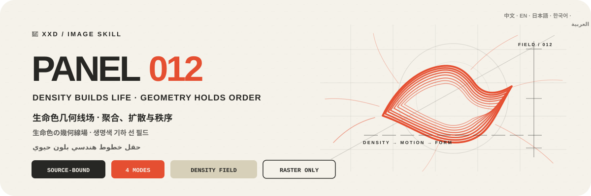
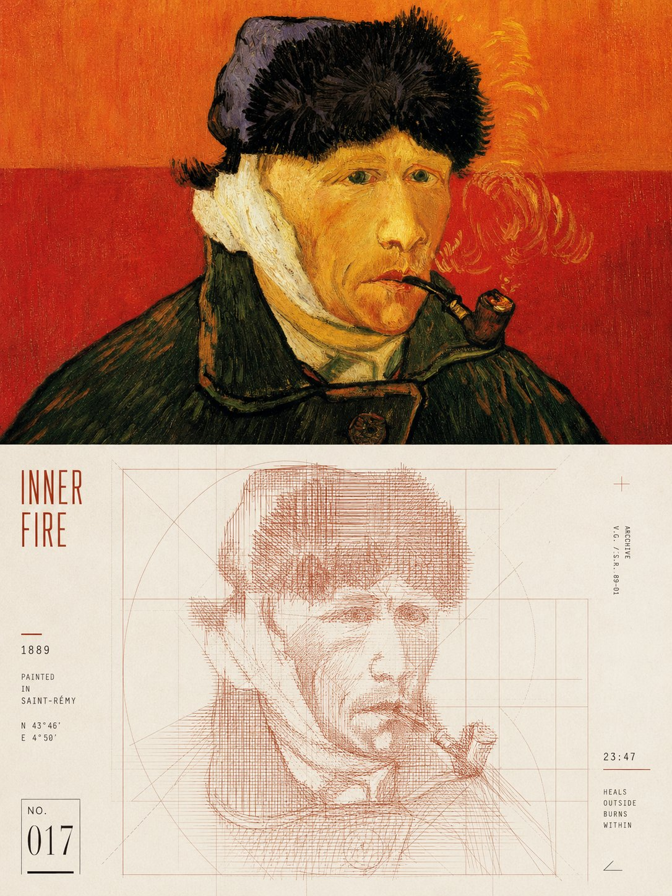
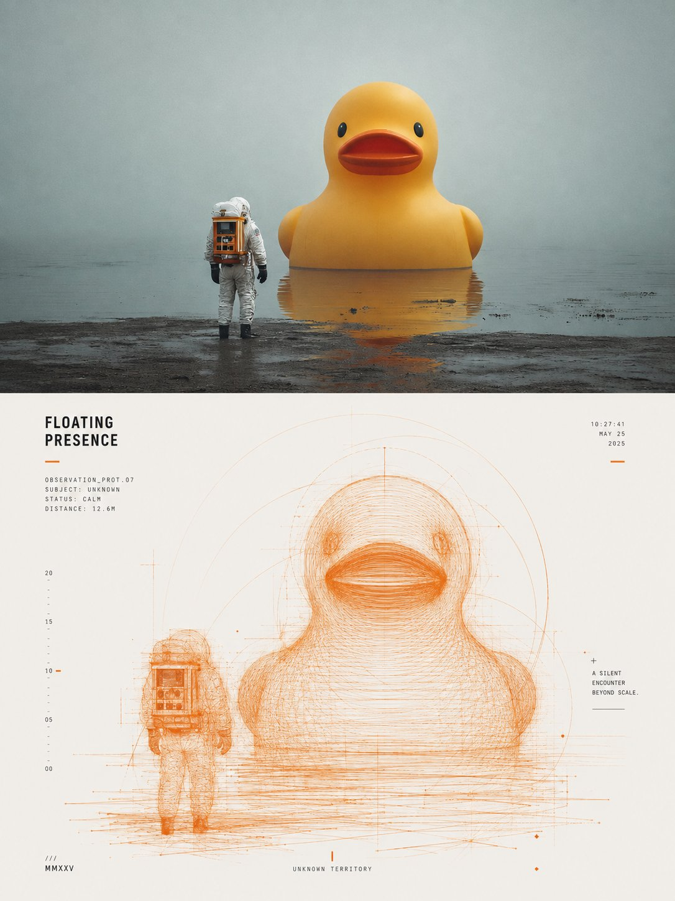

<p align="center">
  
</p>

<div align="center">

# 🦁 XXD Panel 012

### Make the subject emerge from a vital-colour geometric line field

[](./SKILL.md)
[](#four-outputs-one-vital-colour-line-field-logic)
[](#boundaries-and-trust)

<a href="README.md">简体中文</a> · <strong>English</strong> · <a href="README.ja.md">日本語</a> · <a href="README.ko.md">한국어</a> · <a href="README.ar.md">العربية</a>

</div>

> DENSE EMERGENCE · SPARSE DIFFUSION · GEOMETRIC RESTRAINT · ONE VITAL COLOUR · BLACK-GREY MICROTYPE

XXD Panel 012 is an image-generation Skill for Codex and compatible agents. It preserves identity, silhouette, pose, and narrative relation, then makes the subject emerge from high-density repeated lines, offset contour passes, short return loops, and controlled slight jitter: a crisp recognisable edge surrounding an unstable, flowing interior.

Homologous lines become thinner, lighter, and sparser toward the perimeter while axes, diagonals, arcs, tangents, and an implicit grid impose rational order. The main line colour is not averaged by area: it is the one source colour that best carries the subject's vitality and spirit. Black-grey microtype aligns to geometry, contour, and density boundaries to steady the restless field.

## Why it exists

An “experimental line poster” easily collapses into arbitrary scribble, a directionless tangle, a uniform wireframe, or a pseudo-precise cyber interface whose subject is no longer bound to the photograph.

012 reverses that logic:

```text
lock identity / silhouette / pose / relation → aggregate the subject with dense repetition, offset, short returns, and slight jitter → keep a crisp edge and flowing interior → disperse homologous lines outward → restrain the free field with source-earned geometry → choose one source-derived vitality colour → integrate black-grey microtype into the geometric structure
```

If an unrelated photograph could replace the source without materially changing the recognition edge, density centre, line direction, geometric scaffold, main colour, or copy, the result is not 012.

## The 012 visual contract

- **Source identity:** at least three specific cues preserve silhouette, pose, action, structure, negative shape, and narrative relation.
- **Aggregated emergence:** dense repetition, offset contour passes, short returns, and controlled jitter build the subject instead of one complete outline.
- **Density falloff:** the subject centre is dense; homologous lines become visibly thinner, lighter, and sparser outward.
- **Geometric restraint:** only source-earned axes, diagonals, arcs, tangents, or implicit grids divide, align, and counterweight free motion.
- **One vitality colour:** choose by the subject's spirit rather than the largest colour patch; modest purification is allowed, but the colour remains traceable to the source.
- **Clean pale ground and one focus:** generous whitespace and flat print depth, with no dirt, gradient, glow, or 3D.
- **Rational microtype:** one short title and a few state words, indexes, scale marks, or notes align precisely to geometry, contour, and density boundaries.

## Samples · From X

> [Xiaoxiaodong (@xiaoxiaodong01)](https://x.com/xiaoxiaodong01/status/2090105514499911807) · 2026-08-19<br>
> GPT2 x 混乱 x 线条 x 几何 x 美学提示词 x VOL.012

<table>
  <tr>
    <td width="50%"><a href="https://x.com/xiaoxiaodong01/status/2090105514499911807"></a></td>
    <td width="50%"><a href="https://x.com/xiaoxiaodong01/status/2090105514499911807"></a></td>
  </tr>
</table>

<p align="center"><a href="https://x.com/xiaoxiaodong01/status/2090105514499911807">View the original post and full prompt →</a></p>

These samples demonstrate the 012 aesthetic motive. Their subjects, composition, palette, copy, and earlier canvas ratio never become generation references or current defaults.

## Four combinable output modes

Choose one or several modes with `1`, `1+3`, `1,2,4`, or `all`; `all` produces seven separate PNGs per source. After mode selection and before generation, the Skill explicitly asks for the whole finished canvas: the original-prompt `3:4`, an explicit source-aspect choice, a common ratio, or custom ratio/exact pixels. Source dimensions are never applied silently.

| Mode | Canvas rule | Result |
| --- | --- | --- |
| `top-bottom` | user-confirmed whole canvas | one complete generation: high-fidelity source above, 012 design below, approximately 50/50 |
| `left-right` | user-confirmed whole canvas | one complete generation: high-fidelity source left, 012 design right, approximately 50/50 |
| `design-only` | user-confirmed whole canvas | 012 design fills the canvas; source remains invisible |
| `wallpaper-pack` | confirmed per device | separate phone, iPad, desktop, and children's-watch PNGs |

Paired modes use the source as a high-fidelity edit/reference input and one complete style prompt to generate the finished composition directly, so photography, design, colour, light, typography, and meaning can cohere. Deterministic composition is fallback-only: after one targeted complete-canvas retry fails, when pixel-identical source preservation is explicitly required, when the active route cannot realise the canvas, or for lossless final pixel calibration.

Wallpapers may be linked or independent. A linked pack approves one iPad anchor, then recomposes every other device from the original plus that same anchor. An independent pack gives each device only the original. Neither crops another device output nor chains derivatives.

## Copy is the rational structure that steadies the free line field

Before generation, choose automatic copy, custom copy, or text-free output. Name the target language or locale whenever copy is present.

Automatic copy distils one extremely short title from visible or supported emotion, action, time, state, relation, or metaphor. Its voice is restrained, sharp, and alive without inventing biography or forcing meaning.

Add only useful state words, micro-notes, compositional indexes, scale marks, or a restrained philosophical line. Dates, places, provenance, coordinates, measurements, and factual numbers must be supplied or reliably established; compositional indexes must clearly read as indexes rather than fabricated facts. Copy must still pass the unrelated-image swap test.

Finished user wording stays verbatim. A direction or editable draft is refined only while preserving audience, purpose, mandatory words, tone, and implication.

Language follows the intended audience rather than the command language:

```text
target market or audience > requested output language > direction language; if none is explicit, ask before generation
```

A Japanese edition uses natural Japanese, a Korean-audience edition uses natural Korean and correct spacing, a UK edition uses British English, and Arabic defaults to natural Modern Standard Arabic with genuine right-to-left composition. The Skill never guesses nationality from appearance, clothing, scenery, or signs and never uses pseudo-foreign text.

## Complete-canvas first, raster-only delivery

The image model owns the aesthetics of the entire finished composition; paired layouts also default to one complete-canvas generation. `scripts/compose_panel.py` remains only for condition-based recovery, lossless pixel calibration, and read-only audit. It is not run pre-emptively and does not judge aesthetic success.

Every deliverable is a raster PNG and every invocation creates a fresh task under `~/Desktop/xxd/`. The configured image route exposes sanitised status only—never providers, endpoints, credentials, headers, prompts, responses, or account details. SVG, HTML, Canvas, diagrams, and programmatic drawing are not substitutes for the final artwork.

## Get started

```bash
git clone https://github.com/nevertoday/xxd-panel-012.git
mkdir -p ~/.codex/skills
ln -s "$(pwd)/xxd-panel-012" ~/.codex/skills/xxd-panel-012
```

Claude Code users may link the same directory to `~/.claude/skills/xxd-panel-012`. Restart the agent session after installation.

```text
$xxd-panel-012
Turn this photograph into a left-right composition. Derive the copy from the image and write it in natural Korean.
```

You may invoke the Skill with only a photograph. It first asks for one or more modes in a numbered multiline menu, then for copy settings; wallpaper mode also asks for linked/independent continuity and device sizes.

Full specifications:

- [Skill workflow](SKILL.md)
- [Chinese full prompt](references/xxd-panel-012-prompt.zh-CN.md)
- [English full prompt](references/xxd-panel-012-prompt.en.md)
- [Original style brief](references/012-source.md)

## Boundaries and trust

- Each photograph stays within its own task and never borrows subjects, colours, copy, or composition from other inputs, old results, or samples.
- Every invocation creates a fresh task directory; even identical sources and parameters must generate anew.
- Deliverables are PNG bitmaps, never SVG, HTML, Canvas, or programmatic-drawing substitutes.
- The configured bitmap bridge emits sanitised status only and does not expose providers, endpoints, headers, credentials, prompts, or response bodies.
- Each selected ordinary mode returns one file; selected `wallpaper-pack` adds four separate wallpapers. `all` returns seven PNGs per source across four sibling mode directories, never a contact sheet or overview.

Local composition needs Python 3 and Pillow. The safe bitmap bridge uses Python 3.11+ `tomllib`. Image generation still requires a host agent with built-in raster generation or an already configured compatible raster route.

## Repository

```text
xxd-panel-012/
├── SKILL.md
├── README.md / README.en.md / README.ja.md / README.ko.md / README.ar.md
├── agents/openai.yaml
├── assets/
│   ├── banner.svg
│   └── examples/ (reserved for future local samples)
├── scripts/
│   ├── compose_panel.py
│   └── configured_imagegen.py
└── references/
    ├── xxd-panel-012-prompt.zh-CN.md
    ├── xxd-panel-012-prompt.en.md
    └── 012-source.md
```

## About XXD

XXD is the abbreviated brand name of Xiaoxiaodong. This project is created and maintained by [@xiaoxiaodong01](https://x.com/xiaoxiaodong01).

## Support and Membership

### In-depth Consultation · CNY 299/hour

One-to-one consultation for using the Skills is billed at CNY 299 per hour. Contact Xiaoxiaodong through the WeChat QR code below to book.

### Xiaoxiaodong Skills User Community · CNY 99 to join

A one-time CNY 99 fee joins the community for workflow sharing, work discussion, and peer support. It does not include hourly one-to-one consultation. Include “Skills User Community” in your WeChat message.

### Knowledge Planet + Member Prompt Library · CNY 699/year

[Knowledge Planet](https://wx.zsxq.com/group/15554814142882) and the [XXD Member Prompt Library](https://vip.xiaoxiaodong.ai/) are one membership: **one annual payment unlocks both, with no second purchase required.**

1. Subscribe through [Knowledge Planet](https://wx.zsxq.com/group/15554814142882), then contact Xiaoxiaodong on WeChat for a Prompt Library redemption code.
2. Subscribe through the [Member Prompt Library](https://vip.xiaoxiaodong.ai/), then contact Xiaoxiaodong on WeChat for a Knowledge Planet invitation.

<p align="center">
  <a href="https://xiaoxiaodong.pages.dev/assets/wechat-qr.png"></a>
</p>

<div align="center">

**Let the subject grow out of the field: density carries life; geometry holds the order.**

</div>

---

<div align="center">
  <h2>☕ Support this open-source project</h2>
  <p>If this project saved you time, a Star, a share, or a coffee helps keep it moving.</p>
  <table>
    <tr>
      <td align="center" width="240">
        <a href="https://github.com/nevertoday/zhongguo-traditional-colors/blob/main/docs/images/buy-me-a-coffee-qr.png?raw=true"></a><br>
        <strong>Buy me a coffee</strong><br>
        <sub>Scan or open the QR code to support Xiaoxiaodong</sub>
      </td>
    </tr>
  </table>
  <p><sub>Support is entirely optional and never changes access to this open-source project.</sub></p>
</div>
